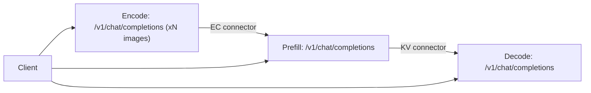
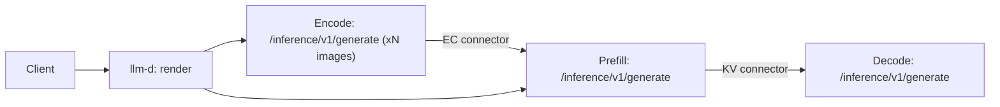
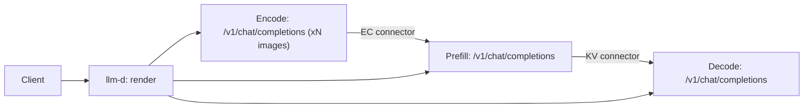

# Preprocessing Pipelines: Chat, Render, and Generate

This page documents what each of the three request-entry APIs actually does to a
multimodal request, and compares three ways of wiring them together in a
disaggregated encode/prefill deployment. The focus is on where text tokenization
and multimodal preprocessing get repeated.

- `/v1/chat/completions` — the OpenAI-compatible entry point
- `/v1/chat/completions/render`, `/v1/completions/render` — the [Renderer APIs](renderer.md)
- `/inference/v1/generate` — the token-in / token-out entry point

## The shared preprocessing pipeline

All three APIs converge on the same renderer code. Nothing below is specific to
one endpoint; the endpoints differ only in where they enter and what they return.

For a chat request the chain is:

```text
preprocess_chat                    vllm/renderers/online_renderer.py
  -> renderer.render_chat_async
  -> _process_multimodal           vllm/renderers/base.py
  -> mm_processor.apply            vllm/multimodal/processing/processor.py
```

`apply()` performs these steps:

| Step | What happens | Notes |
| --- | --- | --- |
| Chat template | Messages rendered to a prompt string | Text only |
| Media fetch + decode | URLs resolved, images/audio/video decoded | Network + CPU |
| Item hashing | Per-item hash derived from the raw media, or a caller-supplied `uuid` | Keys the processor cache and the EC cache |
| HF processor | Resize, normalize, patchify; produces `pixel_values`, `image_grid_thw`, … | The expensive step |
| Placeholder expansion | The single `<image>` token is replaced by N placeholder tokens | `_maybe_apply_prompt_updates` |
| Placeholder extraction | `PlaceholderRange(offset, length, is_embed)` per item | Derived from the step above |

Two properties of this chain drive everything else on this page.

**Placeholder ranges depend on processor output.** `_get_prompt_updates()` takes
`out_mm_kwargs` as a required argument, and its docstring states the returned
information "is critical to determine the token positions in order to construct
`PlaceholderRange`". The placeholder count equals the feature size of the
processed tensor — `image_grid_thw` for Qwen-VL. There is no path that yields
placeholders while skipping the transform.

**Token ids come back expanded.** Because expansion happens inside `apply()`,
every endpoint that returns token ids returns the expanded sequence. This is why
`/tokenize` reports a token count in the thousands for a single image, and why
`tests/entrypoints/scale_out/render/test_render_multimodal.py` can assert
`tokenize_data["tokens"] == render_data["token_ids"]`.

### Where the processor runs

The renderer runs the *HF preprocessor*, not the vision encoder. By default that
is CPU work:

- `--mm-processor-device` defaults to `auto`, which leaves no `device` key in
  `mm_processor_kwargs` and keeps the transform on CPU.
- `auto` resolves to the accelerator only on an **encode-only** instance of an
  EPD deployment, and only when `--mm-tensor-ipc=torch_shm` can carry device
  tensors without a copy back to host (`VllmConfig._resolve_mm_processor_device`).
- Requesting the accelerator on an instance that also runs the language model is
  a hard error: the transform would contend with the forward pass, and its
  allocations sit outside the memory the engine profiled for its KV cache.
- Separately, `--mm-ipc-gpu-memory-gb` (default `0`, disabled) gates frontend
  GPU-side media decoding.

So on a normal server, duplicated preprocessing costs CPU time, host memory, and
payload bytes — not GPU.

## API behavior

### `/v1/chat/completions`

`OpenAIServingChat.render_chat_request` calls `online_renderer.render_chat(request)`
without `skip_mm_cache`, so it uses `self.mm_processor` backed by the **sender
cache**. Repeat images across requests hit that cache and skip the transform.

Accepts raw messages, including `"type": "image_url"` and — when
`--enable-mm-embeds` is set — `"type": "image_embeds"` for pre-computed embeddings.
Returns generated text.

### `/v1/chat/completions/render` and `/v1/completions/render`

`ServingRender.render_chat_request` calls `render_chat(request, skip_mm_cache=True)`,
which routes to `_readonly_mm_processor` — a second processor with its own
processor-only cache, so render traffic does not pollute the sender cache. The
consequence is that **a render server never warms the engine's cache**.

Returns a `GenerateRequest` ready to POST to `/inference/v1/generate`:

```json
{
  "request_id": "chatcmpl-...",
  "token_ids": [...],
  "features": {
    "mm_hashes": {"image": ["abc"]},
    "mm_placeholders": {"image": [{"offset": 15, "length": 1426}]},
    "kwargs_data": {"image": ["<base64 MultiModalKwargsItem>"]}
  },
  "sampling_params": {...}
}
```

`kwargs_data` is **always populated** by `_extract_mm_features` when the prompt is
multimodal. The schema permits `null` (documented as "the item should be resolved
from cache"), but no request flag selects that today.

### `/inference/v1/generate`

The token-in / token-out endpoint. `ServingTokens.serve_tokens` branches three
ways on the request body:

| Body | Behavior | Runs HF processor? |
| --- | --- | --- |
| `features` set | Rebuilds `mm_input` directly from hashes, placeholders, and decoded `kwargs_data` | No |
| `content_parts` set | Resolves media, builds `TokensPrompt` + `multi_modal_data`, calls `render_cmpl_async` | Yes |
| Neither | `preprocess_completion(prompt_input=token_ids, skip_mm_cache=True)` | Text only |

`features` and `content_parts` are mutually exclusive. When `kwargs_data` is
`null`, the modality's items become `[None] * len(hashes)` and the engine must
resolve them from its own cache — a hit is required, or there is nothing to feed
the encoder.

A server started with `--tokens-only` exposes only this endpoint; a GPU-less
render server is started with `vllm launch render`.

### Summary

| | Chat Completions | Render | Generate |
| --- | --- | --- | --- |
| Path | `/v1/chat/completions` | `/v1/chat/completions/render` | `/inference/v1/generate` |
| Input | Messages | Messages | Token ids + `features` or `content_parts` |
| Output | Generated text | `GenerateRequest` | Generated text |
| Runs HF processor | Yes | Yes | Only for `content_parts` |
| Processor cache | Sender cache | Readonly, processor-only | Sender cache |
| Needs GPU | Yes | No | Yes |

## Pipeline comparison

Three ways to wire an encode, prefill, and decode stage behind a router such as
llm-d. In all three, every stage is a separate vLLM instance with its own API
frontend; the encoder publishes embeddings to the prefill instance over the
[EC connector](../../features/disagg_encoder.md), and prefill hands the KV cache
to decode over the KV connector.

Two structural details drive the counts below.

**Every chat-format stage runs a full frontend.** Encode, prefill, and decode
each receive a body carrying `messages`, so each independently applies the chat
template, tokenizes, and processes the media. Decode is the one worth calling out,
because it is the stage that looks like it should be exempt: it receives the KV
cache and never re-runs the prompt forward pass, yet it is not a passive consumer
of the prefill stage's work — its frontend runs in full.

One bypass exists in the chat renderer: a request carrying
`kv_transfer_params.prompt_token_ids` skips templating and tokenization. It does
not rescue any pipeline here, because nothing populates that key and the branch
discards all multimodal state — see
[Why forwarded token ids do not help here](#why-forwarded-token-ids-do-not-help-here).

The three passes are not equal in cost. Encode's body is a synthesized
single-image message with no text (see the next point), so its pass is cheap;
prefill and decode each process the whole prompt.

This is a property of the wire format, not of any stage's role. On the generate
path the same three stages take the `features` branch of `serve_tokens` — no chat
template, no tokenization, no HF processor — which is why Pipeline B's column
below reads 1 for each of those rows: only the render call does the work.

**Encode is a fan-out, one request per media item.** `fanout_encoder_primer` in
`examples/disaggregated/disaggregated_encoder/disagg_epd_proxy.py` and llm-d's
encode step both send N concurrent sub-requests for an N-image prompt. Each
carries a *synthesized* message holding one image part and no text — not the
original prompt — so an encode leg does template and tokenize, but only over that
single part. The tables below count a single image; for N images the encode
contribution scales with N while prefill and decode stay at 1.

### Pipeline A — direct chat API



Each instance receives the chat request and runs its own full frontend. Without
mitigation, the prefill instance builds `pixel_values` it will never use — the
embeddings arrive over the EC connector.

### Pipeline B — decoupled render + generate API



llm-d renders once and sends the resulting `GenerateRequest` downstream. No stage
re-runs the processor: all take the `features` branch, so the whole request is
tokenized exactly once no matter how many stages it visits.

There is a second shape worth distinguishing, because it looks like Pipeline B
but behaves differently. When the **client** posts directly to
`/inference/v1/generate` — having rendered elsewhere — llm-d makes no upstream
render call at all and skips the encode fan-out, leaving the prefill worker to
run the vision encoder inline from `kwargs_data`. That drops one `pixel_values`
transfer but folds encoder compute back into the prefill node, which is the
coupling a separate encode stage exists to avoid. The skip keys off the client's
original path, not off the wire format, so it does not apply to the diagram
above.

### Pipeline C — decoupled render + chat API



llm-d renders to obtain token ids — typically for prefix-cache-aware routing or
context-length checks — then forwards the *original chat request* to every stage.

The render output is not discarded: the token ids build the per-image encode
sub-requests, `mm_placeholders` sizes them, and `mm_hashes` becomes both the EC
cache key and the `uuid` stamped onto each image part of the decode request. What
it does not do is spare any stage from tokenizing.

llm-d attaches the token ids to each downstream chat body as a non-standard
`tokens: {token_ids, features}` field, specifically to avoid re-tokenization.
**vLLM ignores it.** `ChatCompletionRequest` has no `tokens` field, and
`OpenAIBaseModel` sets `extra="allow"` with a debug-only log of unrecognized
keys, so the field is accepted and silently dropped.

That the `messages` survive is an endpoint constraint, not a router design
choice: on the completions path llm-d replaces the prompt outright with
`body["prompt"] = tokenIDs`, and on the generate path it sends a top-level
`token_ids`. It falls back to forwarding `messages` only where the wire format
gives it nowhere to put the ids. This is why Pipeline C cannot be improved from
the router side alone.

### Duplicated work

Counting how many times each unit of work runs per request, for a single-image
request with no cache hits. "A rewritten" is Pipeline A with the proxy rewrite
described [below](#mitigation-available-today-for-pipeline-a).

| Work | A | A rewritten | B | C |
| --- | --- | --- | --- | --- |
| Chat template application | 3 | 3 | 1 | 4 |
| Text tokenization | 3 | 3 | 1 | 4 |
| Network fetch | 3 | 1 | 1 | 1 |
| Image decode | 3 | 1 | 1 | 4 |
| HF processor (`pixel_values`) | 3 | 1 | 1 | 4 |
| Placeholder sizing | 3 | 3 | 1 | 4 |
| Item hashing | 3 | 1 | 1 | 3 |
| `pixel_values` on the wire | 0 | 0 | 3 | 1 |

Pipeline C is the worst case: it pays for a render whose token ids no stage can
use, then repeats the frontend at every stage.

These are event counts, not costs. The full prompt is templated and tokenized at
render, prefill, and decode; the encode leg only ever sees one image part and no
text. So Pipeline C's `4` is better read as three full-prompt passes plus one
cheap per-image pass, and Pipeline A's `3` as two plus one.

Three cells are worth explaining.

**Network fetch is 1 in Pipeline C** because llm-d downloads each image once at
the router and inlines it as a base64 data URI before any stage sees it. The
downstream stages decode base64 and re-decode the image, but never hit the
network. Fetch and decode are counted separately for this reason.

**Item hashing is 3, not 4, in Pipeline C** because llm-d stamps the
render-computed hash onto each image part as a `uuid` before forwarding to
decode, so the decode stage skips content hashing. The encode and prefill bodies
carry no `uuid`.

**`pixel_values` on the wire is 1 in Pipeline C**, and every byte is wasted:
llm-d requires `kwargs_data` in the render response, stores it, and then omits it
from every chat-format body it builds. See
[Deferring `pixel_values` preprocessing](#deferring-pixel_values-preprocessing-rfc-46722).

Note that the rewrite does **not** remove the downstream chat template
applications or tokenizations — the later stages still receive `messages`, so
they still template and tokenize them. What it removes is the media fetch, the
image transform, and the content hash (the proxy supplies the `uuid`).
Placeholder sizing still runs on every stage; after the first it is cheap,
because the grid metadata is supplied rather than derived from pixels.

No cache makes these counts smaller within a single request. The processor cache
is per-instance, so the encode and prefill instances never share one. Text
tokenization is not cached at all. The media fetch cache is opt-in
(`VLLM_MEDIA_CACHE`), on local disk, and also per-instance.

Pipeline B eliminates duplicate compute but moves the cost to the network.
`pixel_values` are typically one to two orders of magnitude larger than the
encoded image they came from — a 1024x1024 image at 14px patches yields roughly
5300 patches, and a `(5300, 1176)` tensor runs to tens of megabytes at fp32,
against a JPEG of a few hundred kilobytes. Whether B beats A depends on whether
preprocessing CPU or inter-node bandwidth is the binding constraint.

The three transfers are render to router, router to encode, and router to
prefill. The last one is avoidable in principle: the prefill stage receives the
embeddings over the EC connector, so its copy of `kwargs_data` is dead weight.
Suppressing it is not possible today, and is the subject of
[RFC #46722](#deferring-pixel_values-preprocessing-rfc-46722).

The client-side-render variant described above does not reduce the count, only
rearrange it. Skipping the encode fan-out removes one transfer, but the client's
original body reaches decode unmodified — nothing in the coordinator strips
`features` — so `kwargs_data` is shipped to decode instead: client to router,
router to prefill, router to decode. Three either way, and the variant also puts
the vision encoder back on the prefill node.

### Why forwarded token ids do not help here

vLLM does have a path that skips tokenization when the caller already holds the
token ids. `_reused_prompt_token_ids` pops `prompt_token_ids` out of the
request's `kv_transfer_params`; when present, `preprocess_chat` bypasses
templating and tokenization and feeds the ids straight to the engine. The
round-trip is covered by `test_kv_transfer_prompt_token_ids_round_trip`, which
sends deliberately mismatched messages and asserts the forwarded ids win.

It rescues no stage in Pipeline A or C, for three reasons:

- **Nothing populates it.** The key has to be set by the caller. No in-tree
  connector writes `prompt_token_ids` into the `kv_transfer_params` it returns,
  and in A and C each stage receives a chat request carrying `messages`.
- **It is a decode-side optimization.** The docstring is explicit: the ids are
  carried "so the decode stage can skip re-tokenizing". That is sound for the
  prefill-to-decode hop, where decode receives the KV cache and never re-runs the
  prompt forward pass — and on a text-only chat request it works today, unused.
  It cannot help encode or prefill, which do have to process the prompt.
- **It drops all multimodal state.** The reuse branch returns
  `tokens_input(reuse_ids, ...)`, a plain `TokensInput` with `type="token"`.
  There is no `multi_modal_data`, no `mm_kwargs`, no hashes, and no placeholders,
  and because `messages` are never parsed the media is never fetched. Forwarding
  ids for a multimodal request would hand the engine placeholder token ids with
  nothing behind them.

So the correct way to skip re-tokenization between stages is Pipeline B — send
token ids plus `features` to `/inference/v1/generate`, which is the endpoint
built to accept them — not to forward ids alongside a chat request.

### Mitigation available today for Pipeline A

`examples/disaggregated/disaggregated_encoder/disagg_epd_proxy.py` implements the
metadata-only rewrite. After the encode stage returns, the proxy reads
`ec_transfer_params.ec_items` from the response — the encoder reports each item's
cache key and the grid its processor actually produced — and rewrites each image
item before forwarding downstream:

```json
{"type": "image_embeds", "image_embeds": {"image_grid_thw": "<b64>"}, "uuid": "<mm_hash>"}
```

The downstream instance then has enough to size the placeholder range without
re-running the transform. This works because `allow_missing_mm_embeddings` is
derived `True` on any EC or KV consumer, which flips the embedding tensor from
required to optional in `MultiModalDataParser.embedding_field_sets` — only the
*metadata* fields (grid/size) stay mandatory.

Two caveats in the reference implementation:

- The grid is never re-derived by the proxy; it is taken from what the encoder
  reported, because a second derivation could disagree.
- If the encoder reports no metadata — for instance the item came from its own
  processor cache — the proxy falls back to forwarding the original media, and
  the downstream instance processes it itself.

With this rewrite, Pipeline A drops to one HF processor run per request while
keeping raw-image-sized payloads.

There is no equivalent rewrite for Pipeline C, because its stages consume chat
requests rather than the `features` payload the rewrite targets. The available
move is to leave Pipeline C for Pipeline B: llm-d exposes this as a single
setting (`use_openai_format: false`), which switches the encode and prefill steps
onto `/inference/v1/generate` and requires no vLLM-side change.

## How llm-d implements EPD disaggregation today

Pipelines A, B, and C above are a taxonomy. This section describes what one real
router does — the coordinator in
[llm-d-inference-scheduler](https://github.com/llm-d/llm-d-inference-scheduler) —
and which pipeline each configuration produces. Paths are relative to that
repository. It is a separate project on its own release cadence, so read this as
a snapshot of observed behavior, not as a contract.

### The step pipeline

Steps are registered in `pkg/coordinator/steps` and ordered by
`config/coordinator/coordinator.yaml`:

| Step | Source | What it does |
| --- | --- | --- |
| `replace-media-urls` | `steps/replace_media_urls.go` | Downloads each image once at the router and rewrites it in place as a `data:<mime>;base64,...` URI. Creates one `MultimodalEntry` per image. Skipped for `/v1/completions`. |
| `render` | `steps/render.go` | POSTs the body to the render server and stores `token_ids` plus, per image, `Hash`, `Placeholder`, and `KwargsData`. |
| `conditional-decode` | `steps/conditional_decode.go` | Optional, commented out in the shipped config. Tries decode with `Prefer: if-available`; a 412 continues the pipeline, a 2xx returns to the client and stops it. |
| `encode` | `steps/encode.go` | Fan-out, one sub-request per image (`max_parallel`, default 8). Merges each response's `ec_transfer_params`. |
| `prefill` | `steps/prefill.go` | One request with the full token sequence, all placeholders, and the merged EC params. Returns `kv_transfer_params`. |
| `decode` | `steps/decode.go` | Proxies to the client's original path, streaming or buffered. |

Every downstream request carries an `EPP-Profile` header (`encode`, `prefill`, or
`decode`) that the gateway uses to select a pod.

Two details of the encode fan-out matter for the counts earlier on this page. Each
sub-request's token sequence is synthesized, not sliced: `buildEncodeTokenIDs`
emits `[BOS] + [placeholder_token] * length` and sets the placeholder offset to 1,
so an encode leg never sees the prompt text. And the render step hard-fails if
`mm_hashes`, `mm_placeholders`, and `kwargs_data` do not all have exactly one
entry per detected image.

### What the format switch selects

`use_openai_format` (default `true`) picks the wire format through
`resolveFormat` in `steps/utils.go`:

| Client path | `use_openai_format: true` | `use_openai_format: false` |
| --- | --- | --- |
| `/v1/chat/completions` | chat format — **Pipeline C** | generate format — **Pipeline B** |
| `/v1/completions` | completions format | completions format (setting not consulted) |
| `/inference/v1/generate` | generate format | generate format |

Completions short-circuits before the setting is read, so `false` does not move
it onto `/generate`. Setting `false` requires a `render` step in the pipeline,
since render is what produces the token ids the generate format sends.

The setting is read by four steps — `encode`, `prefill`, `conditional-decode`,
and `decode` — so it governs the whole tail of the pipeline, not just the two
stages that carry multimodal payloads.

### Default configuration is Pipeline C

Out of the box (`use_openai_format: true`) a chat client gets Pipeline C: llm-d
renders, then forwards the original chat body to encode, prefill, and decode. The
render output is fully used for routing and cache keys — token ids size the encode
sub-requests, `mm_hashes` becomes the EC key and the decode-side `uuid` — but
buys no stage a shortcut past the frontend.

Flipping to `false` gives Pipeline B for chat clients: render still runs, and
encode still fans out, because the encode skip in `steps/encode.go` keys off the
client's original path being `/inference/v1/generate`, not off the format. A
client that posts to `/inference/v1/generate` itself is the one case where encode
is skipped and the prefill worker runs the vision encoder inline.

### What each stage receives

| Stage | Chat format (Pipeline C) | Generate format (Pipeline B) |
| --- | --- | --- |
| Encode | Synthesized one-image message, no text, plus `tokens: {token_ids, features}`. No `kwargs_data` — the encoder re-decodes pixels from the data URI. | `token_ids` + `features` **including** `kwargs_data`. |
| Prefill | Clone of the original body, plus `tokens`, top-level `ec_transfer_params` and `kv_transfer_params`. | `token_ids` + `features` including `kwargs_data`; transfer params nested under `sampling_params.extra_args`. |
| Decode | Original body with a `uuid` stamped on each image part, plus `tokens` and top-level `kv_transfer_params`. | The client's original body, unmodified apart from `kv_transfer_params` under `sampling_params.extra_args`. For a generate client that is `token_ids` + `features` **including** `kwargs_data`; for a chat client it is still `messages`. |

The nesting under `sampling_params.extra_args` is deliberate: the
`/inference/v1/generate` handler reads transfer params only from there and
ignores them at the top level.

### The `tokens` field

Four steps attach a non-standard `tokens: {token_ids, features}` object to chat
bodies, and nothing consumes it. Within llm-d it is written by
`conditional_decode.go`, `encode.go`, `prefill.go`, and `decode.go`, and read by
no code in the repository — including nothing under `pkg/epp/`. It arrives at
vLLM intact, where `ChatCompletionRequest` has no such field and
`OpenAIBaseModel` sets `extra="allow"`, so it is accepted, debug-logged, and
dropped.

The upstream protocol doc (`docs/communication.md` in that repo) states that EPP
strips the field to prevent re-tokenization. That does not match the code, and
the difference is the whole of Pipeline C's tokenization cost.

### Rough edges worth knowing

- **`kwargs_data` is required and then discarded in chat format.** Render
  validation rejects a response whose `kwargs_data` item count does not match the
  image count, so the router pays the full tensor transfer — and then never
  forwards it, because chat-format encode and prefill bodies carry only
  `mm_hashes` and `mm_placeholders`.
- **Decode's format and its URL are chosen independently.** `prepareDecodeBody`
  switches on `resolveFormat`, but `newDecodeProxyRequest` always posts to
  `reqCtx.OriginalPath`. With `use_openai_format: false` and a chat client, decode
  therefore writes `kv_transfer_params` into `sampling_params.extra_args` and
  sends it to `/v1/chat/completions` — an endpoint that reads
  `kv_transfer_params` at the top level and has no `sampling_params` field at all.
  On that combination the decode worker would not pull the prefill KV cache. It
  also costs Pipeline B a tokenization it should not pay: the body still carries
  `messages`, and the chat endpoint templates and tokenizes them, so B-with-a-chat-client
  tokenizes twice (render and decode) rather than once. Confirm against a current
  checkout before relying on it; the gateway may rewrite the path in ways not
  visible in the coordinator.
- **Nothing strips `features` from a forwarded body.** On the generate path the
  decode step proxies `reqCtx.Body` as received, so a generate client's
  `kwargs_data` is shipped a third time, to a stage that has the KV cache and does
  not need pixels.

## Deferring `pixel_values` preprocessing (RFC #46722)

Pipeline B's `pixel_values` transfer is the subject of an open RFC,
[#46722](https://github.com/vllm-project/vllm/issues/46722). The payload is the
motivation: a 12KB JPEG produces a 16KB chat-completions body but a **1.1MB**
generate body, and the RFC reports roughly 21MB at 1080p, rising to ~38MB at
`max_pixels=1.8MP`. `kwargs_data` is base64 msgpack over an uncompressed float
tensor, so it is one to two orders of magnitude larger than the source image.

The proposal has two halves:

1. **`/render`** gains a flag that skips serializing `kwargs_data`, keeping
   `mm_hashes` and `mm_placeholders` for routing and caching.
2. **`/generate`** accepts a raw image and runs the preprocessing itself. The
   existing `kwargs_data: null` cache-hit path is preserved, so the rule becomes
   *null on a cache hit, raw image on a miss*.

This is a payload change, not a preprocessing-count change. **It does not affect
chat template application, text tokenization, or placeholder sizing in any
pipeline.** The duplicate-tokenization problem in Pipelines A and C is untouched.

| Work | A | B today | B + RFC | C today | C + part 1 |
| --- | --- | --- | --- | --- | --- |
| Chat template application | 3 | 1 | 1 | 4 | 4 |
| Text tokenization | 3 | 1 | 1 | 4 | 4 |
| Placeholder sizing | 3 | 1 | 1 | 4 | 4 |
| HF processor (`pixel_values`) | 3 | 1 | 3 | 4 | 4 |
| `pixel_values` on the wire | 0 | 3 | 0 | 1 | 0 |

**Pipeline A is unaffected**; it calls neither endpoint. It is worth noting that
A already has the payload profile the RFC wants for B — raw images on the wire,
each worker preprocessing — so the RFC gives B pipeline A's byte count while
keeping B's single tokenization.

**Pipeline B is the target, but the effect is duplication rather than
relocation.** The RFC describes performing the preprocessing on `/generate`
"instead of" in `/render`, and its trade-off section notes worker-side CPU rises.
The stronger constraint is that render's cost does not go away at all: as
established [above](#the-shared-preprocessing-pipeline), `_get_prompt_updates()`
requires `out_mm_kwargs`, so a render server cannot emit `mm_placeholders`
without first building the tensor. Under the RFC it builds it, discards it, and
each downstream worker rebuilds it from the raw image — render, encode, and
prefill, hence 3.

Two adjacent changes bring that back down. Suppressing the prefill copy entirely
(the subject of #43608, which the RFC calls complementary) removes one, since
prefill gets its embeddings over EC and needs only the grid metadata. Removing
render's discarded build removes another, and a cheaper sizing path already
exists in the model definitions: `Qwen2VLProcessingInfo.get_num_image_tokens`
derives the token count from image dimensions alone, without touching pixel data.
It is currently reached only from the profiling path. A renderer that sized
placeholders through that interface instead of through `apply()` would make the
RFC a true relocation — one HF processor run, on the encoder, where the compute
belongs — and make a GPU-less render server substantially cheaper.

One coordinator-side prerequisite: llm-d's generate-format encode body carries
only `token_ids` and `features`, with the image reaching the encoder solely as
`kwargs_data`. If render stops emitting it, the coordinator has to put the raw
image in the encode body instead. That is within the spirit of RFC part 2 but is
not a vLLM-side change.

**Pipeline C benefits from part 1 alone**, without any `/generate` work. llm-d
requires `kwargs_data` in the render response and rejects a response whose item
count does not match, stores it on each entry, and then never sends it: the
chat-format encode and prefill bodies both carry only `mm_hashes` and
`mm_placeholders`. Every byte of that transfer is discarded today. Adopting the
flag removes it, and requires llm-d to relax its response validation to treat
missing `kwargs_data` as valid rather than as a protocol error.

## Reducing duplicate work

Each item below follows from a mechanism established earlier on this page, and is
grouped by who has to make the change.

### Available today

**Move chat traffic to the generate format.** `use_openai_format: false` turns
Pipeline C into Pipeline B with no vLLM change: chat template application,
tokenization, and HF processor runs each drop from 4 to 1, paid for in
`pixel_values` bandwidth. Fix the decode format/path split first, or decode will
neither pull the KV cache nor stop tokenizing.

**Rewrite encoder output for Pipeline A.** The `disagg_epd_proxy.py` metadata
rewrite drops A's processor runs from 3 to 1 while keeping raw-image payloads. It
needs a proxy in the path but no render server.

### Router-side, no vLLM change needed

**Stamp `uuid` on every stage's image parts, not just decode.** llm-d computes a
stable content hash at render and injects it as `uuid` on the decode body only;
the encode and prefill bodies carry none, so those instances re-derive the hash
from the image bytes. Supplying it everywhere skips per-item hashing and keys each
instance's processor cache consistently across requests. Free, and it applies to
both wire formats.

**For text-only chat requests, forward the ids in `kv_transfer_params`.** The chat
renderer honors `kv_transfer_params.prompt_token_ids` and skips templating and
tokenization outright. llm-d has the ids and already writes `kv_transfer_params`
on the decode leg — it just puts the ids in `tokens`, which vLLM drops. Moving
them saves decode's full-prompt tokenization.

Gate this on the request having no multimodal entries. The reuse branch returns a
bare token input with no `mm_kwargs`, hashes, or placeholders, and never parses
`messages`, so applying it to an image request hands the engine placeholder tokens
with nothing behind them — wrong output rather than an error.

### vLLM-side

**Let the chat endpoint accept token ids alongside multimodal state.** This is the
highest-leverage change here and the root cause of Pipeline C's counts.
`kv_transfer_params.prompt_token_ids` is the right idea with the wrong payload: it
carries ids and discards everything multimodal. A chat-request field carrying
`token_ids` plus `mm_hashes` and `mm_placeholders` — the `features` shape
`/inference/v1/generate` already accepts — would let every chat-format stage skip
templating, tokenization, and placeholder sizing, collapsing Pipeline C onto
Pipeline B's counts without moving anyone off the OpenAI wire format. It would
also give llm-d's existing `tokens` field somewhere to land.

**Size placeholders without building the tensor.**
`Qwen2VLProcessingInfo.get_num_image_tokens` derives the token count from image
dimensions alone and is currently reached only from the profiling path. Routing
render's placeholder sizing through that interface would make a GPU-less render
server dramatically cheaper and is the precondition for RFC #46722 being a
relocation rather than a duplication.

**Shrink the `pixel_values` payload.** RFC #46722 covers the render-to-worker hop
and #43608 the prefill copy; see
[Deferring `pixel_values` preprocessing](#deferring-pixel_values-preprocessing-rfc-46722).
These target bytes, not preprocessing counts.

### Why not use the generate format end to end?

Pipeline C exists because a router serving OpenAI clients needs OpenAI-shaped
responses, and `/inference/v1/generate` returns token ids. The
[Derenderer APIs](derenderer.md) close that loop — `/v1/chat/completions/derender`
reuses vLLM's tool and reasoning parsers on the GPU-less frontend — which in
principle lets a router run generate end to end and derender at the edge.

The blocker today is streaming: the derender endpoints expect a complete
`GenerateResponse` with all token ids present and parse it in one shot. Streaming
derender is planned but needs a separate endpoint design, so until it lands any
deployment serving `stream: true` still needs a chat-format decode stage. That
makes the chat-side fixes above complementary to a generate-format migration
rather than superseded by it.

## Known gaps

- **`kwargs_data` cannot be suppressed.** `ServingRender._extract_mm_features`
  serializes tensors unconditionally. Emitting `null` for items the engine
  already caches would need the render path to consult the sender cache — which
  conflicts with its `skip_mm_cache=True` design. RFC #46722 proposes an explicit
  flag instead; see
  [Deferring `pixel_values` preprocessing](#deferring-pixel_values-preprocessing-rfc-46722).
- **The chat endpoint cannot accept token ids.** `ChatCompletionRequest` has no
  field for a pre-tokenized prompt, and `extra="allow"` means a router that sends
  one — as llm-d does, via `tokens` — gets no error and no benefit. This is the
  root cause of Pipeline C's counts, and it is independent of RFC #46722.
- **Render servers cannot warm the engine cache.** The readonly processor keeps a
  separate processor-only cache by design, so rendering never populates the
  sender cache that `/v1/chat/completions` and `/inference/v1/generate` use.
- **`is_embed` does not round-trip.** `PlaceholderRangeInfo` carries only `offset`
  and `length`; the TODO in `token_in_token_out/protocol.py` notes `is_embed` must
  be added "once the /generate side consumes features". Models with sparse
  placeholder masks — anything using `PromptUpdateDetails.select_token_id`, such
  as Gemma-3, where the span includes non-embedding tokens — are not safe over the
  `features` path. Flat-run models such as Qwen-VL are unaffected.
- **`/tokenize` discards multimodal metadata.** It computes hashes and
  placeholders, then returns only `tokens`, `token_strs`, `count`, and
  `max_model_len`. It costs the same as `/render` on multimodal input, so it is
  not a cheaper way to size a prompt.
